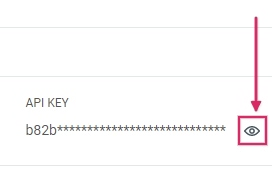
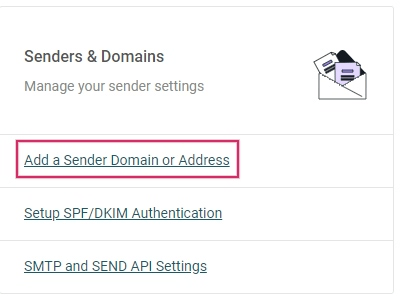
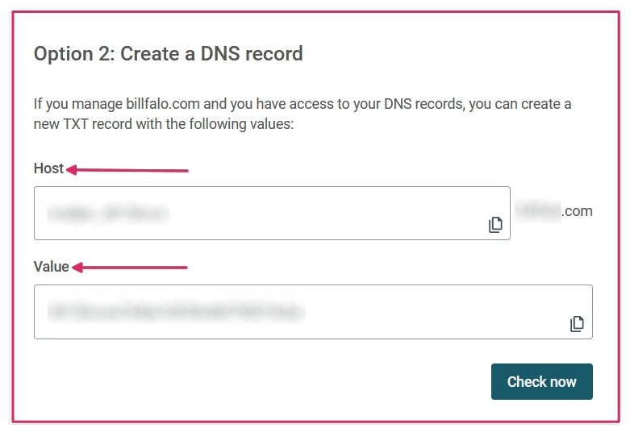
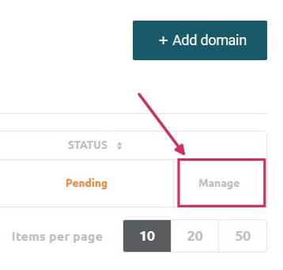
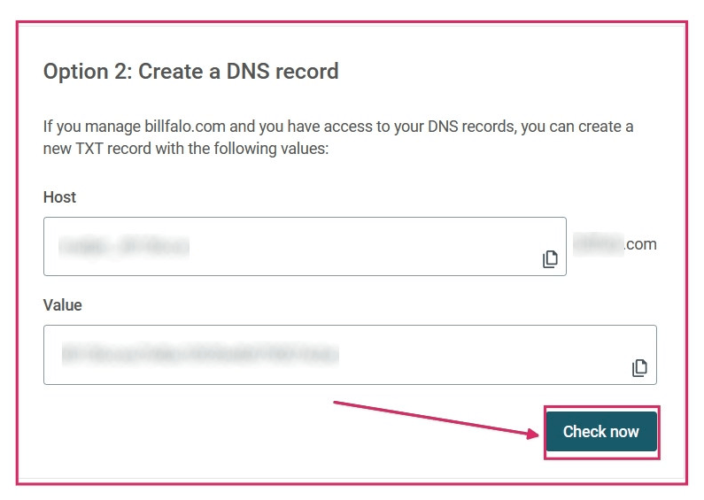

============================
Set up Mailjet API with Odoo
============================

Odoo is compatible with Mailjet's API for mass mailing. There are some settings that need to be
configured on Mailjet, some in Odoo and in some circumstances, on the custom domain's DNS settings.
Set up a dedicated mass mailing server through Mailjet in no time!

Set up in Mailjet
=================

Create API credentials
----------------------

To get started, sign in to `Mailjet's Account Information <https://app.mailjet.com/account>`_ page.
Navigate to the Senders & Domains section and click on :guilabel:`SMTP and SEND API Settings`.

.. image:: mailjet_api/api-settings.png
   :align: center
   :alt: SMTP and Send API Settings link in the Mailjet interface.

Copy the SMTP Configuration down to a Notepad; these are located on the right-hand side of the
screen. The settings include the server address, the security option needed (TLS), and the port
number. The :ref:`next section <mailjet-api/verified-sender>` will use these settings while
configuring Mailjet in Odoo. Here is
`Mailjet's SMTP Configuration documentation <https://documentation.mailjet.com/hc/en-us/articles/
360043229473-How-can-I-configure-my-SMTP-parameters->`_ for more information.

.. note::
   Odoo blocks port 25 on SAAS and Odoo.sh databases. `See reference here <https://www.odoo.com/
   documentation/15.0/applications/general/email_communication/email_servers.html#restriction>`_.

.. image:: mailjet_api/smtp-config.png
   :align: center
   :alt: SMTP configuration from Mailjet.

Next, retrieve the API credentials which will be inputted in the Odoo configuration. Click on the
button labeled :guilabel:`Retrieve your API credentials`.

Reveal the :guilabel:`API key` by clicking on the eye icon. Copy this key to a Notepad as this will
serve as the *Username* in Odoo. Generate the :guilabel:`Secret Key` by clicking on the
:guilabel:`Generate Secret Key` button. Copy this key to a Notepad. This will serve as the
*password*.

.. _mailjet-api/verified-sender:

Add verified sender addresses or domain
---------------------------------------

The next step is to add a sender address or domain to Mailjet's settings so that the email address
or domain will be approved to send using Mailjet's servers. Navigate to `Mailjet's Account
Information <https://app.mailjet.com/account>`_ page. Click on :guilabel:`Add a Sender Domain or
Address`.

Determine if a sender's email address or the entire domain need to be added onto Mailjet's
settings. By default, the address originally set up in the Mailjet account will be added on as a
trusted sender. To add an email address, click on the button labeled :guilabel:`Add a sender
address`. Add the email address that is configured to send from the custom domain. It may be easier
to configure the domain as a whole if DNS access is available.

.. note::
   Either all email addresses of users in the database sending using Mailjet will need to be
   configured or the domain(s) of the users' email addresses should be configured.

| At minimum the following email addresses should be
| set up in your provider and verified in Mailjet:

- notifications\@yourdomain.com
- bounce\@yourdomain.com
- catchall\@yourdomain.com

Fill out the *Email Information* form, making sure to select an email type: transactional email or
mass emails. After completing the form, an activation email will be sent to the email address to
activate the trusted sender. It is recommended to set up SPF/DKIM/DMARC settings on the domain of
this sender. See `Mailjet's SPF/DKIM/DMARC documentation <https://documentation.mailjet.com/hc/
en-us/articles/360042412734-Authenticating-Domains-with-SPF-DKIM>`_ on setting those records.

.. important::
   Should the database not be using a custom domain, then in order to verify the sender's address,
   a temporary alias (of the three email addresses mentioned above) should be set up in the Odoo CRM
   to create a lead. You are then able to receive the verification email and verify the accounts.

By adding an entire domain, all the sender addresses related to that domain will be automatically
validated when adding them manually or sending emails from them. Click on :guilabel:`Add domain` to
add the custom domain.

.. note::
   The domain will need to be validated through the domain name system.

Fill out the *Add a new Domain* page and click :guilabel:`Continue`.

After adding the domain, a validation page will populate. Unless the database is on-premise (Option
1), choose Option 2: Create a DNS Record. Copy the TXT record information to a Notepad and navigate
to the domain's DNS provider.

Setup in the domain's DNS
=========================

Add a TXT record to the domain's DNS (Domain Name System). This process will vary depending on the
DNS provider. Consult the provider for specific configuration processes. The TXT record will
consist of the *Host* and *Value*, or *Text*, populated in the previous step in Mailjet's account
information. Paste these into the corresponding fields in your TXT record.

Return to Mailjet account information
=====================================

Then navigate to :menuselection:`Account Information --> Add a Sender Domain or Address --> Gear
Icon by Domain --> Validate` This can also be reached through the `Sender domains & addresses
<https://app.mailjet.com/account/sender>`_ page on Mailjet's account information and clicking on
:guilabel:`manage`.

Click :guilabel:`Check Now`. This will validate the TXT record you added on your domain. A success
screen will appear if the domain is configured correctly.

After successfully setting up the domain, there is an option to *Authenticate the domain
(SPF/DKIM)*. This button will populate SPF & DKIM records to input into the DNS provider. See
`Mailjet's SPF/DKIM documentation <https://documentation.mailjet.com/hc/en-us/articles/
360042412734-Authenticating-Domains-with-SPF-DKIM>`_ on setting those records.

.. image:: mailjet_api/authenticate.png
   :align: center
   :alt: Authenticate the domain with SPF/DKIM records in Mailjet.

Set up in Odoo
==============

To complete the setup, navigate to the Odoo database. With
:ref:`developer-mode` turned on, go to the
:menuselection:`Technical Menu --> Email --> Outgoing Mail Servers`. Create a new outgoing server
configuration by clicking on the :guilabel:`Create` button.

Input the *SMTP server (in-v3.mailjet.com)*, *port number (587 or 465)*, and *Security (SSL/TLS)*
from the Notepad that were copied earlier; they can also be found `here <https://app.mailjet.com/
account/setup>`_. It is recommended to use SSL/TLS even through Mailjet may not require it.

For the *Username*, input the :guilabel:`API KEY`, and for the *Password*, input the
:guilabel:`SECRET KEY` that was copied to the Notepad earlier. These settings can be found here, or
on :menuselection:`Mailjet -->  Account Settings --> SMTP and SEND API Settings`.

Set the priority higher than that of your transactional email server(s), if this server is used for
mass emailing. Save your settings and *Test the Connection*.

.. image:: mailjet_api/server-settings.png
   :align: center
   :alt: Odoo outgoing email server settings.

.. important::
   In order for the notifications feature to work using MailJet there are three settings that need
   to be set in Odoo.

   #. The :guilabel:`From Filter` will need to be set on the server configuration. It is recommended
      to set it as a domain and not a full email address. It should match the domain in the two
      proceeding steps. More information can be referenced
      :ref:`here <email_servers/outgoing-email-server>`.
   #. The :guilabel:`mail.default.from` system parameter should have the value
      `notifications\@yourdomain.com`.
   #. The :guilabel:`mail.default.from_filter` system parameter should have the value
      `yourdomain.com`

.. note::
   More on setting these parameters can be found :ref:`here <email_domain/default>`.

.. important::
   Replace `yourdomain` with the custom domain for your database and if there isn't one then use the
   :guilabel:`mail.catchall.domain` system parameter.

The setup is complete and the database is ready to use the Mailjet email server for mass mailing or
transactional emails!
