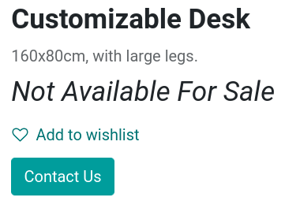
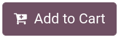
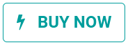
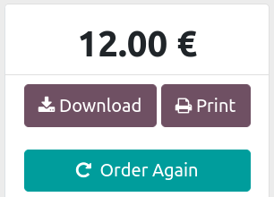

===========
Add to cart
===========

(introduction)

'Add to Cart' action customization
==================================

You can customize the main action of the :guilabel:`Add to Cart` button on the product page to
perform one of the following actions:

- (Add to cart and) stay on the product page;
- (Add to cart and) redirect to the cart page;
- (Add to cart and) open a dialog box to let the user choose.

To configure the action button, go to :menuselection:`Configuration --> Settings --> Shop - Checkout
Process`, and select one of the three options under the :guilabel:`Add to Cart` section.

.. note::
   The action of the :guilabel:`Add to Cart` button is specific per website.

Hide the 'Add to Cart' button
=============================

If you do not need or wish to use the :guilabel:`Add to Cart` button, you can replace the button
with a :guilabel:`Contact Us` button which integrates a custom **redirect URL** of your choice.
When clicking on the :guilabel:`Contact Us` button, customers are then taken to the specified
**redirect URL**.

To do so, go to :menuselection:`Configuration --> Settings --> Shop - Products` and tick
:guilabel:`Prevent Sale of Zero Priced Product`. This creates a new :guilabel:`Button url` field
where you can enter the **redirect URL** to be used. Then, set the price of the product to `0.00`
either from the **product's template**, or from a
:doc:`pricelist <../../../sales/sales/products_prices/prices/pricing>`.

.. tip::
   Hiding the :guilabel:`Add to Cart` button is often used by B2B eCommerces that need to restrict
   purchases to customers with an account, but still want to display an online product catalog.

Custom 'Add to Cart' button
===========================

You can also create a custom :guilabel:`Add to Cart` button and link it to a specific product.
The **custom button** can be added on any pages of the website as an **inner content** building
block, and is an *additional* button to the regular :guilabel:`Add to Cart` button.

To add it, go on the **product page** of your choice, click :menuselection:`Edit --> Blocks` and
place the building block. Once placed, you have the following options:

- :guilabel:`Product`: select the product to link the button with. Selecting a product renders the
  :guilabel:`Action` field available;
- :guilabel:`Action`: choose if the button should :guilabel:`Add to Cart` or :guilabel:`Buy Now`
  (instant checkout).

'Buy Now' button
================

You can enable the :guilabel:`Buy Now` button to instantly take the customer to **checkout** instead
of adding the product to the cart. The :guilabel:`Buy Now` button is an *additional* button and
does not replace the :guilabel:`Add to Cart` button. To enable it, go to
:menuselection:`Configuration --> Settings --> Shop - Checkout Process` and tick
:guilabel:`Buy Now`.

Re-order from portal
====================

Customers have the possibility to **re-order** items from a **previous sales order** on the customer
portal. To do so, go to :menuselection:`Configuration --> Settings --> Shop - Checkout Process` and
enable :guilabel:`Re-order From Portal`. Customers can find the :guilabel:`Re-order` button on their
**sales order** from the **customer portal**.

